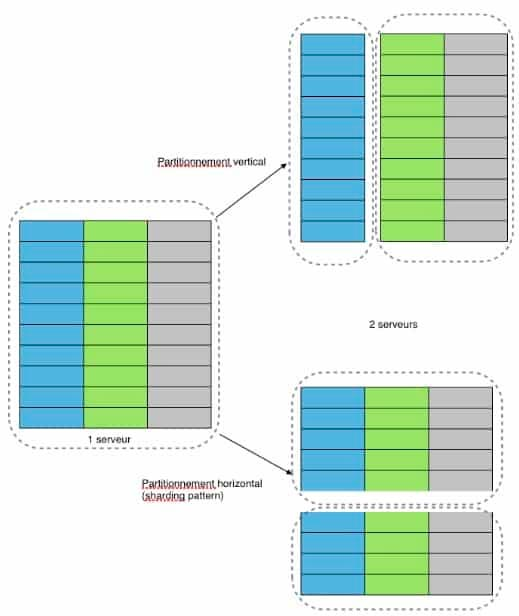

# **Le sharding (partitionnement)** 
Apparu bien avant la blockchaine, le sharding est un concept issu du monde des bases de données traditionnelles consistant à fragmenter (partitioner) et à distribuer une grande base de données consistant à diviser des bases de données Big Data en Data Set (ou jeu de données) de taille réduite afin d’accélérer leur traitement ou de les gérer plus facilement, voire tout cela en même temps.  
Quel que soit le critère utilisé pour ce faire, toutes les requêtes ne nécessitant l’accès qu’à une partie des données sont exécutées plus vite, car il y a moins de données à analyser. Le débit des transactions est optimisé et les ressources de stockage et de calcul sont réparties sur l’ensemble du réseau.
## **Le sharding horizontal**
Chaque nouvelle table a le même schéma mais des lignes uniques.  
L’ajout de machines à une pile existante pour répartir la charge, augmentant la vélocité de traitement et supporter plus de traffic. Cette méthode est particulièrement efficace lorsque les requêtes renvoient un sous-ensemble de lignes qui sont souvent regroupées.
## **Le sharding vertical**
Le schéma de chaque nouvelle table est un sous-ensemble fidèle à celui de la table originelle.  
Efficace quand les requêtes ne renvoient généralement qu’un sous-ensemble de colonnes de données.  

## **Les avantages et inconvénients du sharding**
Avantages | Inconvénients
:-:|:-:
Dépasser la capacité d’une seule machine en hébergeant les données sur différents serveurs | Une mauvaise implémentation risque d’engendrer une perte de données irrécupérables 
Plus véloce car beaucoup plus d’informations pourront être traitées chaque seconde | Possibilité de déséquilibre entre les fragments et ralentissement du traitement des informations
Plus sécurisant de répartir ses données sur plusieurs serveurs | La possession de plusieurs serveurs est un souci de cybersécurité facilitant l’attaque
Economique car il y a moins de moyens à mettre en œuvre pour acheter et sécuriser un gros serveur | 
## **Les prérequis**
Il faut avoir accès à l’ensemble des données. Tous les accès se font via une clé de partition (appelée Shard Key).   
Ainsi, lors du processus de préparation d’une partition, une série de transformations du sous modèle de données doit être mise en œuvre.  
Chaque table d’une base de données partitionnée doit posséder une colonne correspondant à la shard key ; il doit y avoir unicité de toutes les partitions ; la jointure entre les tables est impérativement réalisée à partir de la même clé de partition.
## Conclusion
Le Sharding est un avantage, en partitionnant les données il permet un gain de vitesse, de sécurité et une diminution des coûts. Son implémentation se déroule selon un processus strict.  
Cette technique est très utilisée en cryptomonnaies. Et aussi très utiles aux géants du Web (Google, Wikipédia, Amazon, Facebook, LinkedIn, etc).
___
>>>Sources  
[BitPanda](https://www.bitpanda.com/academy/fr/lecons/quest-ce-que-le-sharding/)  
[Le Big Data](https://www.lebigdata.fr/sharding-definition-avantage)  
[DataScientext](https://datascientest.com/sharding-definition)